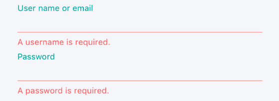
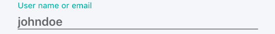
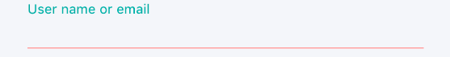

# Validation

Any app that accepts input from users should ensure that the input is
valid. An app could, for example, check for input that contains only
characters in a particular range, is of a certain length, or matches a
particular format. Without validation, a user can supply data that
causes the app to fail. Validation enforces business rules, and prevents
an attacker from injecting malicious data.

{width="6.259722222222222in"
height="4.125694444444444in"}In the context of the Model-ViewModel-Model
(MVVM) pattern, a view model or model will often be required to perform
data validation and signal any validation errors to the view so that the
user can correct them. The eShopOnContainers mobile app performs
synchronous client-side validation of view model properties and notifies
the user of any validation errors by highlighting the control that
contains the invalid data, and by displaying error messages that inform
the user of why the data is invalid. Figure 6-1 shows the classes
involved in performing validation in the eShopOnContainers mobile app.

**Figure 6-1**: Validation classes in the eShopOnContainers mobile app

View model properties that require validation are of type
ValidatableObject\<T\>, and each ValidatableObject\<T\> instance has
validation rules added to its Validations property. Validation is
invoked from the view model by calling the Validate method of the
ValidatableObject\<T\> instance, which retrieves the validation rules
and executes them against the ValidatableObject\<T\> Value property. Any
validation errors are placed into the Errors property of the
ValidatableObject\<T\> instance, and the IsValid property of the
ValidatableObject\<T\> instance is updated to indicate whether
validation succeeded or failed.

Property change notification is provided by the ExtendedBindableObject
class, and so an Entry control can bind to the IsValid property of
ValidatableObject\<T\> instance in the view model class to be notified
of whether or not the entered data is valid.

# Specifying validation rules

Validation rules are specified by creating a class that derives from the
IValidationRule\<T\> interface, which is shown in the following code
example:

public interface IValidationRule\<T\>\
{\
    string ValidationMessage { get; set; }\
    bool Check(T value);\
}

This interface specifies that a validation rule class must provide a
boolean Check method that is used to perform the required validation,
and a ValidationMessage property whose value is the validation error
message that will be displayed if validation fails.

The following code example shows the IsNotNullOrEmptyRule\<T\>
validation rule, which is used to perform validation of the username and
password entered by the user on the LoginView when using mock services
in the eShopOnContainers mobile app:

public class IsNotNullOrEmptyRule\<T\> : IValidationRule\<T\>\
{\
    public string ValidationMessage { get; set; }\
\
    public bool Check(T value)\
    {\
        if (value == null)\
        {\
            return false;\
        }\
\
        var str = value as string;\
        return !string.IsNullOrWhiteSpace(str);\
    }\
}

The Check method returns a boolean indicating whether the value argument
is null, empty, or consists only of whitespace characters.

Although not used by the eShopOnContainers mobile app, the following
code example shows a validation rule for validating email addresses:

public class EmailRule\<T\> : IValidationRule\<T\>\
{\
    public string ValidationMessage { get; set; }\
\
    public bool Check(T value)\
    {\
        if (value == null)\
        {\
            return false;\
        }\
\
        var str = value as string;\
        Regex regex = new Regex(@\"\^(\[\\w\\.\\-\]+)@(\[\\w\\-\]+)((\\.(\\w){2,3})+)\$\");\
        Match match = regex.Match(str);\
\
        return match.Success;\
    }\
}

The Check method returns a boolean indicating whether or not the value
argument is a valid email address. This is achieved by searching the
value argument for the first occurrence of the regular expression
pattern specified in the Regex constructor. Whether the regular
expression pattern has been found in the input string can be determined
by checking the value of the Match object\'s Success property.

**Note:** Property validation can sometimes involve dependent
properties. An example of dependent properties is when the set of valid
values for property A depends on the particular value that has been set
in property B. To check that the value of property A is one of the
allowed values would involve retrieving the value of property B. In
addition, when the value of property B changes, property A would need to
be revalidated.

# Adding validation rules to a property

In the eShopOnContainers mobile app, view model properties that require
validation are declared to be of type ValidatableObject\<T\>, where T is
the type of the data to be validated. The following code example shows
an example of two such properties:

public ValidatableObject\<string\> UserName\
{\
    get\
    {\
        return \_userName;\
    }\
    set\
    {\
        \_userName = value;\
        RaisePropertyChanged(() =\> UserName);\
    }\
}\
\
public ValidatableObject\<string\> Password\
{\
    get\
    {\
        return \_password;\
    }\
    set\
    {\
        \_password = value;\
        RaisePropertyChanged(() =\> Password);\
    }\
}

For validation to occur, validation rules must be added to the
Validations collection of each ValidatableObject\<T\> instance, as
demonstrated in the following code example:

private void AddValidations()\
{\
    \_userName.Validations.Add(new IsNotNullOrEmptyRule\<string\> \
    { \
        ValidationMessage = \"A username is required.\" \
    });\
    \_password.Validations.Add(new IsNotNullOrEmptyRule\<string\> \
    { \
        ValidationMessage = \"A password is required.\" \
    });\
}

This method adds the IsNotNullOrEmptyRule\<T\> validation rule to the
Validations collection of each ValidatableObject\<T\> instance,
specifying values for the validation rule\'s ValidationMessage property,
which specifies the validation error message that will be displayed if
validation fails.

# Triggering validation

The validation approach used in the eShopOnContainers mobile app can
manually trigger validation of a property, and automatically trigger
validation when a property changes.

## Triggering validation manually

Validation can be triggered manually for a view model property. For
example, this occurs in the eShopOnContainers mobile app when the user
taps the **Login** button on the LoginView, when using mock services.
The command delegate calls the MockSignInAsync method in the
LoginViewModel, which invokes validation by executing the Validate
method, which is shown in the following code example:

private bool Validate()\
{\
    bool isValidUser = ValidateUserName();\
    bool isValidPassword = ValidatePassword();\
    return isValidUser && isValidPassword;\
}\
\
private bool ValidateUserName()\
{\
    return \_userName.Validate();\
}\
\
private bool ValidatePassword()\
{\
    return \_password.Validate();\
}

The Validate method performs validation of the username and password
entered by the user on the LoginView, by invoking the Validate method on
each ValidatableObject\<T\> instance. The following code example shows
the Validate method from the ValidatableObject\<T\> class:

public bool Validate()\
{\
    Errors.Clear();\
\
    IEnumerable\<string\> errors = \_validations\
        .Where(v =\> !v.Check(Value))\
        .Select(v =\> v.ValidationMessage);\
\
    Errors = errors.ToList();\
    IsValid = !Errors.Any();\
\
    return this.IsValid;\
}

This method clears the Errors collection, and then retrieves any
validation rules that were added to the object\'s Validations
collection. The Check method for each retrieved validation rule is
executed, and the ValidationMessage property value for any validation
rule that fails to validate the data is added to the Errors collection
of the ValidatableObject\<T\> instance. Finally, the IsValid property is
set, and its value is returned to the calling method, indicating whether
validation succeeded or failed.

## Triggering validation when properties change

Validation is also automatically triggered whenever a bound property
changes. For example, when a two-way binding in the LoginView sets the
UserName or Password property, validation is triggered. The following
code example demonstrates how this occurs:

\<Entry Text=\"{Binding UserName.Value, Mode=TwoWay}\"\>\
    \<Entry.Behaviors\>\
        \<behaviors:EventToCommandBehavior\
            EventName=\"TextChanged\"\
            Command=\"{Binding ValidateUserNameCommand}\" /\>\
    \</Entry.Behaviors\>\
    \...\
\</Entry\>

The Entry control binds to the UserName.Value property of the
ValidatableObject\<T\> instance, and the control\'s Behaviors collection
has an EventToCommandBehavior instance added to it. This behavior
executes the ValidateUserNameCommand in response to the TextChanged
event firing on the Entry, which is raised when the text in the Entry
changes. In turn, the ValidateUserNameCommand delegate executes the
ValidateUserName method, which executes the Validate method on the
ValidatableObject\<T\> instance. Therefore, every time the user enters a
character in the Entry control for the username, validation of the
entered data is performed.

For more information about behaviors, see [Implementing
behaviors](#implementing-behaviors).

# Displaying validation errors

The eShopOnContainers mobile app notifies the user of any validation
errors by highlighting the control that contains the invalid data with a
red line, and by displaying an error message that informs the user why
the data is invalid below the control containing the invalid data. When
the invalid data is corrected, the line changes to black and the error
message is removed. Figure 6-2 shows the LoginView in the
eShopOnContainers mobile app when validation errors are present.

**Figure 6-2:** Displaying validation errors during login

## Highlighting a control that contains invalid data

The LineColorBehavior attached behavior is used to highlight Entry
controls where validation errors have occurred. The following code
example shows how the LineColorBehavior attached behavior is attached to
an Entry control:

\<Entry Text=\"{Binding UserName.Value, Mode=TwoWay}\"\>\
    \<Entry.Style\>\
        \<OnPlatform x:TypeArguments=\"Style\"\
          iOS=\"{StaticResource EntryStyle}\"\
          Android=\"{StaticResource EntryStyle}\"\
          WinPhone=\"{StaticResource UwpEntryStyle}\"/\>\
    \</Entry.Style\>\
    \...\
\</Entry\>

The Entry control consumes an explicit style, which is shown in the
following code example:

\<Style x:Key=\"EntryStyle\"\
       TargetType=\"{x:Type Entry}\"\>\
    \...\
    \<Setter Property=\"behaviors:LineColorBehavior.ApplyLineColor\"\
            Value=\"True\" /\>\
    \<Setter Property=\"behaviors:LineColorBehavior.LineColor\"\
            Value=\"{StaticResource BlackColor}\" /\>\
    \...\
\</Style\>

This style sets the ApplyLineColor and LineColor attached properties of
the LineColorBehavior attached behavior on the Entry control. For more
information about styles, see
[Styles](https://developer.xamarin.com/guides/xamarin-forms/user-interface/styles/)
on the Xamarin Developer Center.

When the value of the ApplyLineColor attached property is set, or
changes, the LineColorBehavior attached behavior executes the
OnApplyLineColorChanged method, which is shown in the following code
example:

public static class LineColorBehavior\
{\
    \...\
    private static void OnApplyLineColorChanged(\
                BindableObject bindable, object oldValue, object newValue)\
    {\
        var view = bindable as View;\
        if (view == null)\
        {\
            return;\
        }\
\
        bool hasLine = (bool)newValue;\
        if (hasLine)\
        {\
            view.Effects.Add(new EntryLineColorEffect());\
        }\
        else\
        {\
            var entryLineColorEffectToRemove = \
                    view.Effects.FirstOrDefault(e =\> e is EntryLineColorEffect);\
            if (entryLineColorEffectToRemove != null)\
            {\
                view.Effects.Remove(entryLineColorEffectToRemove);\
            }\
        }\
    }\
}

The parameters for this method provide the instance of the control that
the behavior is attached to, and the old and new values of the
ApplyLineColor attached property. The EntryLineColorEffect class is
added to the control\'s Effects collection if the ApplyLineColor
attached property is true, otherwise it\'s removed from the control\'s
Effects collection. For more information about behaviors, see
[Implementing behaviors](#implementing-behaviors).

The EntryLineColorEffect subclasses the RoutingEffect class, and is
shown in the following code example:

public class EntryLineColorEffect : RoutingEffect\
{\
    public EntryLineColorEffect() : base(\"eShopOnContainers.EntryLineColorEffect\")\
    {\
    }\
}

The RoutingEffect class represents a platform-independent effect that
wraps an inner effect that\'s platform-specific. This simplifies the
effect removal process, since there is no compile-time access to the
type information for a platform-specific effect. The
EntryLineColorEffect calls the base class constructor, passing in a
parameter consisting of a concatenation of the resolution group name,
and the unique ID that\'s specified on each platform-specific effect
class.

The following code example shows the
eShopOnContainers.EntryLineColorEffect implementation for iOS:

\[assembly: ResolutionGroupName(\"eShopOnContainers\")\]\
\[assembly: ExportEffect(typeof(EntryLineColorEffect), \"EntryLineColorEffect\")\]\
namespace eShopOnContainers.iOS.Effects\
{\
    public class EntryLineColorEffect : PlatformEffect\
    {\
        UITextField control;\
\
        protected override void OnAttached()\
        {\
            try\
            {\
                control = Control as UITextField;\
                UpdateLineColor();\
            }\
            catch (Exception ex)\
            {\
                Console.WriteLine(\"Can\'t set property on attached control. Error: \", ex.Message);\
            }\
        }\
\
        protected override void OnDetached()\
        {\
            control = null;\
        }\
\
        protected override void OnElementPropertyChanged(PropertyChangedEventArgs args)\
        {\
            base.OnElementPropertyChanged(args);\
\
            if (args.PropertyName == LineColorBehavior.LineColorProperty.PropertyName \|\|\
                args.PropertyName == \"Height\")\
            {\
                Initialize();\
                UpdateLineColor();\
            }\
        }\
\
        private void Initialize()\
        {\
            var entry = Element as Entry;\
            if (entry != null)\
            {\
                Control.Bounds = new CGRect(0, 0, entry.Width, entry.Height);\
            }\
        }\
\
        private void UpdateLineColor()\
        {\
            BorderLineLayer lineLayer = control.Layer.Sublayers.OfType\<BorderLineLayer\>()\
                                                             .FirstOrDefault();\
\
            if (lineLayer == null)\
            {\
                lineLayer = new BorderLineLayer();\
                lineLayer.MasksToBounds = true;\
                lineLayer.BorderWidth = 1.0f;\
                control.Layer.AddSublayer(lineLayer);\
                control.BorderStyle = UITextBorderStyle.None;\
            }\
\
            lineLayer.Frame = new CGRect(0f, Control.Frame.Height-1f, Control.Bounds.Width, 1f);\
            lineLayer.BorderColor = LineColorBehavior.GetLineColor(Element).ToCGColor();\
            control.TintColor = control.TextColor;\
        }\
\
        private class BorderLineLayer : CALayer\
        {\
        }\
    }\
}

The OnAttached method retrieves the native control for the Xamarin.Forms
Entry control, and updates the line color by calling the UpdateLineColor
method. The OnElementPropertyChanged override responds to bindable
property changes on the Entry control by updating the line color if the
attached LineColor property changes, or the Height property of the Entry
changes. For more information about effects, see
[Effects](https://developer.xamarin.com/guides/xamarin-forms/application-fundamentals/effects/)
on the Xamarin Developer Center.

{width="6.259722222222222in"
height="0.78125in"}When valid data is entered in the Entry control, it
will apply a black line to the bottom of the control, to indicate that
there is no validation error. Figure 6-3 shows an example of this.

**Figure 6-3**: Black line indicating no validation error

The Entry control also has a DataTrigger added to its Triggers
collection. The following code example shows the DataTrigger:

\<Entry Text=\"{Binding UserName.Value, Mode=TwoWay}\"\>\
    \...\
    \<Entry.Triggers\>\
        \<DataTrigger \
            TargetType=\"Entry\"\
            Binding=\"{Binding UserName.IsValid}\"\
            Value=\"False\"\>\
            \<Setter Property=\"behaviors:LineColorBehavior.LineColor\" \
                    Value=\"{StaticResource ErrorColor}\" /\>\
        \</DataTrigger\>\
    \</Entry.Triggers\>\
\</Entry\>

This DataTrigger monitors the
UserName.IsValid property, and if it\'s value becomes false, it executes
the Setter, which changes the LineColor attached property of the
LineColorBehavior attached behavior to red. Figure 6-4 shows an example
of this.

**Figure 6-4**: Red line indicating validation error

The line in the Entry control will remain red while the entered data is
invalid, otherwise it will change to black to indicate that the entered
data is valid.

For more information about Triggers, see
[Triggers](https://developer.xamarin.com/guides/xamarin-forms/application-fundamentals/triggers/)
on the Xamarin Developer Center.

## Displaying error messages

The UI displays validation error messages in Label controls below each
control whose data failed validation. The following code example shows
the Label that displays a validation error message if the user has not
entered a valid username:

\<Label Text=\"{Binding UserName.Errors, Converter={StaticResource FirstValidationErrorConverter}\"\
       Style=\"{StaticResource ValidationErrorLabelStyle}\" /\>

Each Label binds to the Errors property of the view model object that\'s
being validated. The Errors property is provided by the
ValidatableObject\<T\> class, and is of type List\<string\>. Because the
Errors property can contain multiple validation errors, the
FirstValidationErrorConverter instance is used to retrieve the first
error from the collection for display.

# Summary

The eShopOnContainers mobile app performs synchronous client-side
validation of view model properties and notifies the user of any
validation errors by highlighting the control that contains the invalid
data, and by displaying error messages that inform the user why the data
is invalid.

View model properties that require validation are of type
ValidatableObject\<T\>, and each ValidatableObject\<T\> instance has
validation rules added to its Validations property. Validation is
invoked from the view model by calling the Validate method of the
ValidatableObject\<T\> instance, which retrieves the validation rules
and executes them against the ValidatableObject\<T\> Value property. Any
validation errors are placed into the Errors property of the
ValidatableObject\<T\> instance, and the IsValid property of the
ValidatableObject\<T\> instance is updated to indicate whether
validation succeeded or failed.